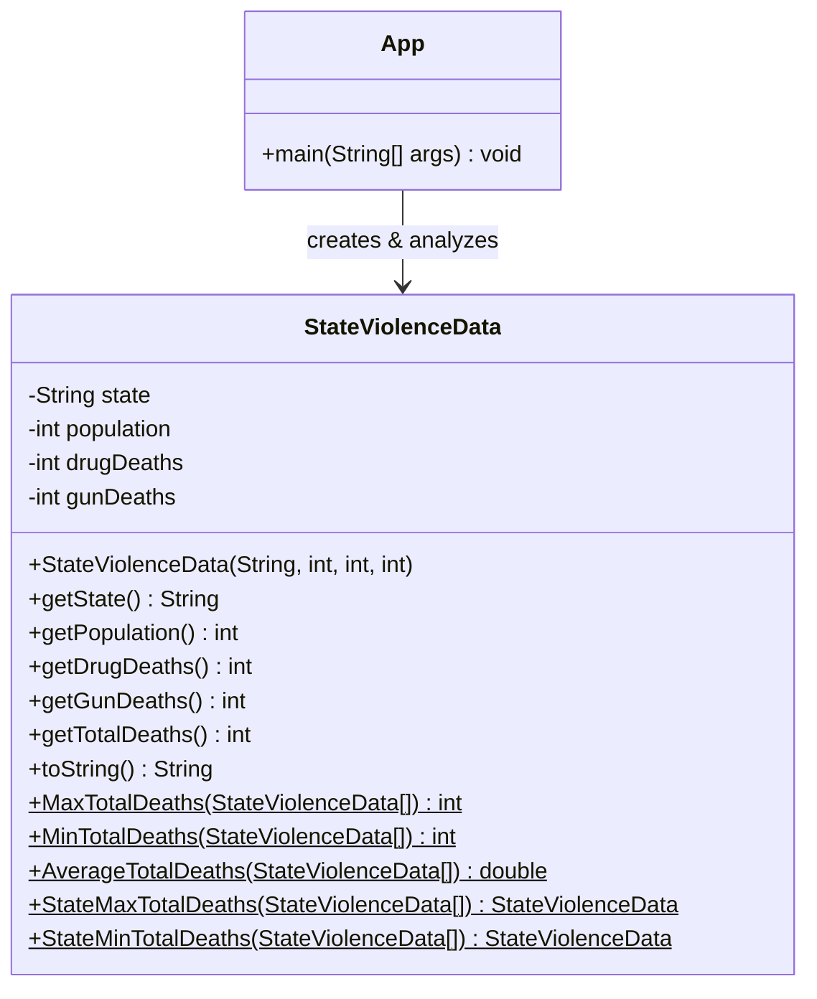

# 📊 State Violence Data Analysis
### *"Fun with Spreadsheets and Existential Dread"*

---

## Overview

Welcome to the **State Violence Data Analysis Mini-Project** — where we take a perfectly cheerful dataset about gun deaths and drug overdoses and use it to practice Java. Nothing like mortality statistics to make you appreciate object-oriented programming!

This project reads a CSV file of 2016 state-level data (sourced from the CDC, because nothing says *"learning activity"* like the CDC), parses it into objects, and performs basic statistical analysis. Think of it as Excel, but you had to build Excel yourself. From scratch. In Java.

---

## Project Structure

```
project/
├── App.java               ← The boss. Runs everything.
├── StateViolenceData.java ← The data model. Holds all the sad numbers.
└── ViolenceData.csv       ← The CSV. 52 rows of America doing its thing.
```

---

## UML Diagram



> `$` denotes static methods. They don't need an object to run — they're independent. Living their best life.

---

## Dataset

**File:** `ViolenceData.csv`  
**Source:** CDC (Centers for Disease Control and Prevention), 2016  
**Columns used:**

| Index | Column | Type |
|-------|--------|------|
| 0 | State name | String |
| 1 | Population | int |
| 4 | Firearm deaths (total) | int |
| 6 | Drug overdose deaths (total) | int |

> Puerto Rico's row is skipped automatically because its values are all `-1`. It's not a bug — Puerto Rico just really didn't want to participate in this particular spreadsheet.

---

## How It Works

1. **First pass through the CSV** — counts how many valid rows exist so we know how big to make the array. (No ArrayLists allowed. We do things the hard way here.)
2. **Second pass** — actually reads the data and fills the array with `StateViolenceData` objects.
3. **Analysis** — calls static methods to find the min, max, and average total deaths across all states.
4. **Prints results** — tells you which state had the most deaths, which had the fewest, and the average. A fun dinner party conversation starter.

---

## Analysis Methods

| Method | What it does |
|--------|--------------|
| `MaxTotalDeaths(data[])` | Finds the highest total deaths across all states |
| `MinTotalDeaths(data[])` | Finds the lowest total deaths across all states |
| `AverageTotalDeaths(data[])` | Computes the mean total deaths |
| `StateMaxTotalDeaths(data[])` | Returns the *state object* with the most total deaths |
| `StateMinTotalDeaths(data[])` | Returns the *state object* with the fewest total deaths |

---

## 🐛 Known Bug (Fix Me!)

There is a **NullPointerException** lurking in `StateViolenceData.java` like a raccoon in a dumpster. Both `StateMaxTotalDeaths` and `StateMinTotalDeaths` initialize their tracking variable to `null`, then immediately try to call `.getTotalDeaths()` on it inside the loop. Java will not appreciate this.

**Broken:**
```java
StateViolenceData maxState = null;
for (StateViolenceData s : data) {
    if (s.getTotalDeaths() > maxState.getTotalDeaths()) { // 💥 NullPointerException
```

**Fixed:**
```java
StateViolenceData maxState = data[0]; // Start with the first entry, not nothing
for (StateViolenceData s : data) {
    if (s.getTotalDeaths() > maxState.getTotalDeaths()) { // ✅ Works great
```

---

## Sample Output

```
Number of states loaded: 51
Max total deaths: 7432
Min total deaths: 147
Average state deaths: 1402.8
State with highest total deaths: California (7838)
State with lowest total deaths: North Dakota (167)
```
*(Actual numbers will vary — go find out!)*

---

## How to Run

1. Make sure `ViolenceData.csv` is in the same directory as your compiled `.class` files (or update the file path in `App.java`).
2. Compile:
   ```bash
   javac App.java StateViolenceData.java
   ```
3. Run:
   ```bash
   java App
   ```
4. Marvel at the statistics. Reflect on life. Submit your assignment.

---

## Guiding Question

> *"Do states with larger populations have proportionally more combined gun and drug deaths?"*

Short answer: mostly yes, with some notable exceptions (looking at you, West Virginia — 1.8M people, 52 drug overdose deaths per 100K). Population is a factor, but it's not the whole story. Culture, policy, and economics all play a role, which is way more nuanced than this README is qualified to cover.

---

## Credit

- Dataset: CDC.gov (2016)
- Project template: CS Plus Plus / GitHub Classroom
- Existential crisis: included at no extra charge

---

*Built with Java, Scanner, and the quiet knowledge that there are no ArrayLists allowed.*
